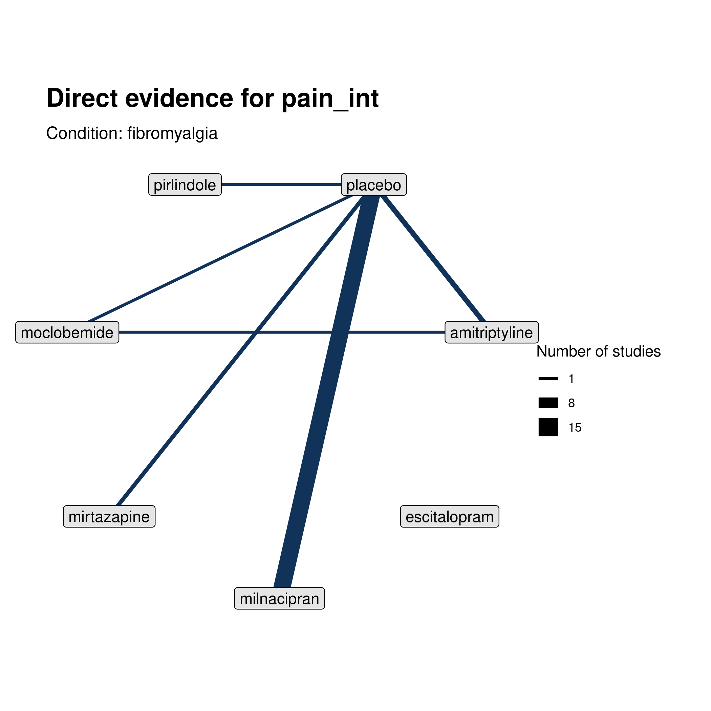
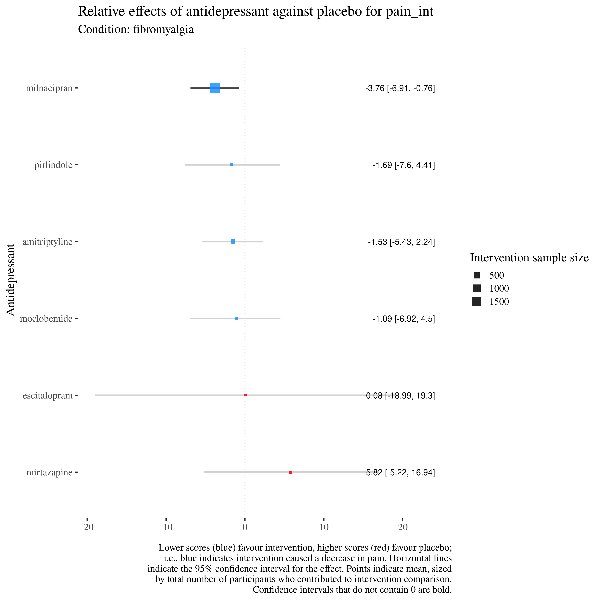

```{r setup, include=FALSE, message=FALSE}
knitr::opts_chunk$set(echo = FALSE)
# knitr::opts_knit$set(root.dir = here::here())

library(targets)
library(tidyverse)
library(knitr)

```

# Protocol | Current progress toward what we said we'd do

## Protocol: what we said we'd do | Outcomes

### Outcomes

- [x] Primary outcomes: pain intensity (continuous scale), substantial pain (50% reduction), moderate pain (30% reduction)
- [x] Secondary outcomes: Mood, adverse events, physical functioning, quality of life, sleep, withdrawal
```{r echo=FALSE}
# tar_read(w_outcomes)

```

- [ ] Secondary outcome: patient global impression of change

## Protocol: what we said we'd do | Subgroups

- [x] Timepoints
- [x] Conditions
- [x] Type of intervention
- [x] Class of antidepressant

## Protocol | Timepoint subgroups

## Protocol | Conditions

## Protocol | Types of Intervention

## Protocl | Classes of antidepressants

# Analyses

## Analyses | Structure of analysis

Each analysis comprises: 

- [x] Network diagram of direct evidence
- [x] Forest plot 
- [x] Pairwise comparisons of within-intervention studies
- [ ] Sensitivity

## Analyses: Example network

```{r network plot, out.height="550px", out.width="550px", fig.align = "center"}


```

## Analyses | Example forest plot

```{r forest plot, out.height="550px", out.width="550px", fig.align = "center"}


```


## Analyses | Example pairwise analysis

## Analyses | Current presentation

### Webbook

Online book presenting all analyses with separate chapters for each outcome, timepoint, type of intervention.

Subsections for conditions. 

### Interactive tool

Online interactive tool for selecting studies, conditions, class, etc. and running network meta-analysis on selections.

NB: NMA takes several minutes to run.