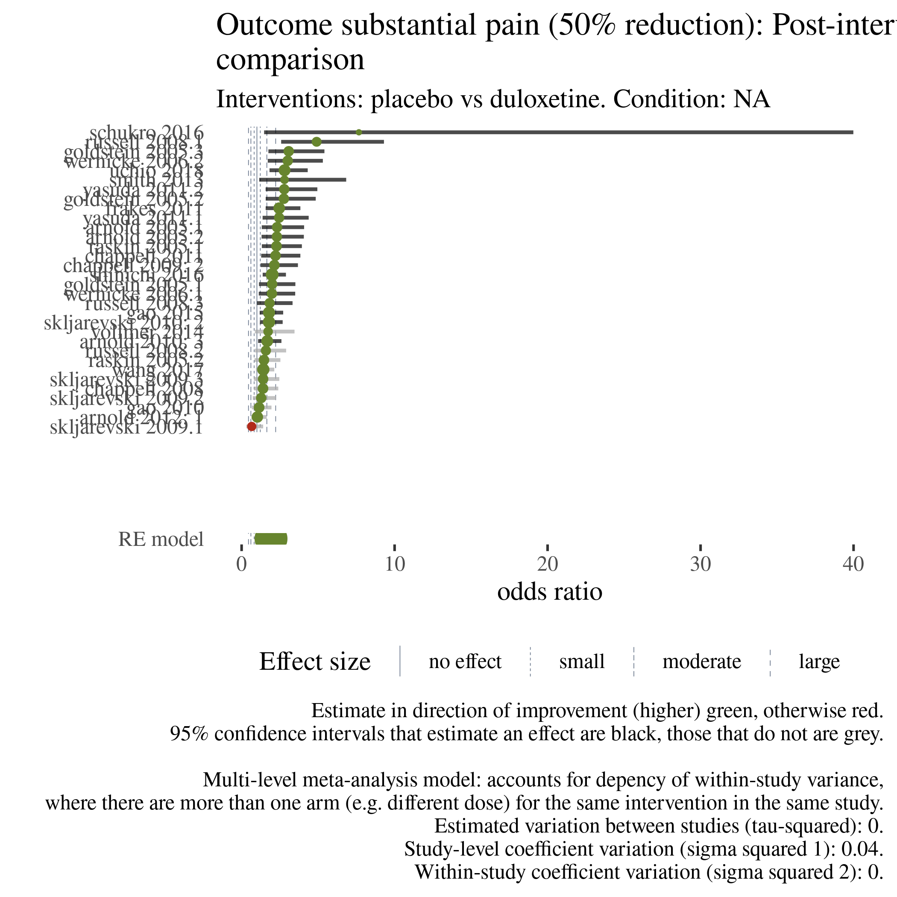

```{r setup, include=FALSE}
knitr::opts_chunk$set(echo = TRUE)

# knitr::opts_knit$set(root.dir = "report")

```

## Pairwise comparisons


```{r}


# 
```

```{r}
list.files("bksite/images/pw-forest", full.names = TRUE) %>% 
  pluck(1) %>% 
  knitr::include_graphics()

```

